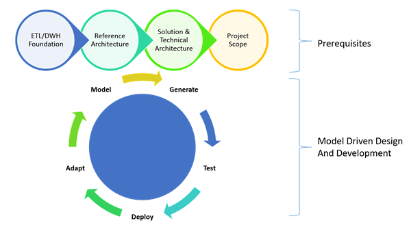

# Reference Solution Architecture - overview

The reference Solution Architecture ('reference architecture') is designed to facilitate a platform-independent, flexible and manageable data solution. 

The fundamental principles of the reference architecture is to *design for change* by decoupling 'technical' and 'business' logic, and to ensure each data integration process can run independently and in parallel with built-in recovery mechanisms. Both of these principles are means to enable scalability and flexibility. 

The reference architecture aims to provide guidelines for decoupling (functional separation) of the various elements of the data solution, so new or changed requirements can be incorporated without re-engineering the data solution foundations. 

## Relationship to the Data Integration framework

As an overarching concept, the Data Integration framework is defined as a collection of components which can be used in conjunction with each other, or as stand-alone additions to existing data solutions. For example, the framework includes pre-defined documents, templates, design- and implementation decisions as well as guidelines on auditability and process control (orchestration approaches).

The Solution Architecture can be seen as the artefact that *combines* the selected options (patterns) and records the considerations - the rationale for making certain design decisions and how the selected components work together.

In short: the Data Integration framework provides the options and the Solution Architecture records which of these options have been selected for given purpose, and why. 

## Purpose of the reference Solution Architecture

This document describes how various concepts can be combined to create the foundation of an enterprise-grade data solution, such as a Data Warehouse. 

In this context, a solution architecture is essentially the selection and documentation of various design decisions including the reasoning for taking a certain approach. The documentation of options and considerations - represented by the selected Design- and Solution patterns.

This way, the resulting solution architecture artefact provides the (project-customised) principles and guidelines to assist the delivery team in creating a scalable, maintainable and durable data solution.

At a high level, the reference architecture describes the following:

- What (architecture) layers and areas can be considered
- What the high level steps for data integration are, and in what order they should be processed
- What the options and considerations are for each of these steps
- How ETL process control metadata is used and linked to the layers and areas
- How exception handling can be applied to the layers and areas

## Objectives from a business perspective

To the business, the reference architecture focuses on:

- The ability quickly respond to changing business requirements. By using defined layers and areas, the architecture aims to *separate concerns* by allocating certain components and functionality to layers and areas
- Reliable use of data for decision making and analysis. This is supported through the application of consistency and durability principles (i.e. ACID) in the data environment at technical and application level.
- Reduction of time to value and expected levels of quality. This is supported by metadata driven and pattern based development practices (i.e. virtualisation, ETL generation and Data Warehouse Automation)

## Objectives from a technology perspective

The reference architecture provides a structure against which best practices can be applied. It outlines the boundaries and rules that govern the behaviour of the intended data solution. 

The key technical objectives are:

- Enabling refactoring without impacting consumers of information. By decoupling data storage and management (warehouse) and business logic (transformation), changes and additions can be applied without the need to change the underlying solution. Technical improvements can be executed without impacting the reporting environments by using versioning.
- Built-in handling of (ETL) complexities, integration and dependencies; pre-defined solutions for error handling, parallelism, reconciliation, recovery and handling of business rules provide a data platform that requires no re-engineering.
- Making sure data components are built once, and reused many times.
- Enabling Pattern-based design (also known as model driven design); define the information model, and expand the data solution gradually and consistently.
- ETL quality and consistency; Data Warehouse Automation (template driven ETL generation) provides a repeatable and dynamic development process which reduces the need for extensive documentation and can support DevOps style delivery approaches.
- The information is provided to the users is consistent, and can be reconciled. This is supported by applying ACID principles to the ETL patterns; to make sure information (query results, reports, etc.) can be (automatically) validated for integrity at certain points in time.

# Principles

The assumption is that requirements will change over time, and that a data solution that specifically is designed for a certain output or requirement may fail over time when adjustments are made. This is especially the case for interpretation of information, i.e. business requirements. It takes time and collective experience to truly 'nail' the interpretation of data, by adding the context that turns data into information.

The reference architecture views the data solution as a way to manage the data asset of a company, by enabling the design to continuously adjust to a changing environment, both technical and functional. 

By implementing pattern-based development and ETL generation approaches the design metadata becomes the core intellectual property that drives (and forward engineers in DevOps) the data solution to keep up with the business changes.

Everything changes, but managing data as asset by allowing for flexibility in deployment and gradual interpretation of data makes this manageable.

The following fundamental concepts underpin the reference architecture:

- **Hybrid data modelling**. Traditionally Data Warehouse models have been classified as either fully normalised (i.e. Corporate Information Factory) or fully denormalised (Dimensional Modelling / Dimensional Bus Architecture). A hybrid approach utilises components of both concepts. A degree of normalisation ensures that every meaningful (business) entity has its own separate table for distributing surrogate keys and one where history is stored in a traditional Type-2 (denormalised and historised) way. Depending on the selected modelling technique relationships can also be modelled separately. Examples of hybrid data modelling approaches are Data Vault, Focal Point, Anchor, Head-and-Version and Matter.
- **Modular solution design**. The reference architecture is designed to be customised for individual scenarios. This means every component is in principle designed to be modular. For example:
  - ETL metadata and process control, which is a stand-alone component (i.e. DIRECT)
  - Error handling and recycling, including concepts such as the Error Bitmap and reprocessing of failed data loads
  - Persistent Staging Area, as a log of processed events which can be added to the data solution as a separate schema or file storage area
- **Separation of Data Warehouse concepts in ETL**. The core functionality within a Data Warehouse is divided in individual modular ETL components. This is different to for instance the ETL pattern for loading a typical 'Kimball' dimension (Dimensional Bus Architecture) where keys, structure and history are combined in a single ETL process. Separating this into smaller (modular) functional components provides additional flexibility and maintainability in the future. This includes, but is not limited to:
  - Data Warehouse key distribution (including hashing of business keys)
  - Storing and tracking history (managing time-variant data)
  - Defining structure and hierarchy
  - Cleaning and integration (business rules)
- **Design for change**. Designing for change in this context means designing to be future proof, as opposed to designing for a specific business requirement or purpose. This is core principle of the reference architecture that includes:
  - The ability to load data even when relationships between data change. Most hybrid modelling techniques use many-to-many relationships separate of the main entities, even when the data could currently be modelled as one-to-many without a separate relationship table.
  - Catering for different levels of completeness of data. This impacts the way errors are handled / rejected and the specification of failure.
  - Providing multiple versions of the truth (multiple Information Marts for the same data) to support different interpretations of data.
  - Handling changing business rules. To be able to always represent data in another way, this impacts the integration approach and the Information Mart concept.
  - Separate original and transformed data while still retaining the relationship between the two to support lineage and auditability, as well as refactoring of ETL and data models
  - Applying business rules / logic as late as possible: in the delivery of the information (Presentation Layer)
- **Flexibility in scheduling**. The reference architecture is designed for a possible future of handling near real-time data sources and changes in data refresh frequencies for batch processing. Essentially, the design intends allow changes in scheduling independent from ETL design.
- **Corporate memory**. The data solution collects, integrates and manages all data but does not ‘invent’ new data or addresses data quality directly. Data quality concerns are ideally handled by the operational systems, supported by exception reporting. Data quality and interpretation of information is managed via Data Governance. This principle also means that no information is physically deleted from the Data Warehouse and logical deletes are supported at all times.  

# Using the reference solution architecture

The reference architecture serves as an outline to relate ETL examples and best-practices to. The main purpose is to create a common ground to which every involved developer can become familiar with.

The reference architecture also provides the basic structure for the documentation of the data solution. Every component of the design and implementation can be captured in the Design- and Solution patterns, which can be related to the reference architecture. This includes tips, tricks and examples of implementation considerations. 

These design and development artefacts are designed to be as generic as possible without losing practical value.

## Executing a project

In principle every project that contributes to the data solution follows a similar lifecycle. At a high level this is as follows:

- Define Project Scope; this is a breakdown of a requirement in data terms. What data is needed to meet requirements in the broader sense (answer this and similar questions). This scope of data becomes the input for bottom-up planning of data integration
- Review & update the Solution Architecture and Technical Architecture, as well as supporting Design- and Solution patterns using the reference architecture. This documents how new sources are interfaced and integrated into the data solution. For example how to determine data delta, where data should be stored, what the intent and upstream logical model is etc.
- Define metadata and execute Pattern Based Development (Model Driven Design). Once the data is identified both in scope and way of interfacing the metadata can be entered to drive ETL generation and (automated) testing. Model changes can be made accordingly, after which the ETL can be re-generated.

By design this is an iterative approach, and scope can be limited to support short-time iterations such as a 2-3 weeks cycle.

# High level architecture

The reference architecture introduces the concept of Layers and Area. In principle, and while this is configurable, the reference design contains three Layers, each housing two Areas. 

## Layers

A Layer is a high level container for functionality that has the same high level purpose. They shares data modelling characteristics and intent. Process flows, as implemented in ETL, always work from one Layer to the next one. 

The differences between layer are most prominently reflected in the data modelling techniques used, and not necessarily the technical components. It is perfectly possible to have a single Layer span different technical environments.

## Areas

An Area is a strictly defined part of a Layer with a dedicated role or function. Areas within a Layer share the same modelling approach, patterns and techniques but are functionally separate. An example is a Raw Data Vault and the related Business Data Vault. These two areas are both part of the Integration Layer, and share the same modelling approach - as defined by the layer of which they are part of. 

Together, they are *the* data model, but functionally they are different.

## Patterns

The reference architecture describes each Layer and its Areas and refers to Design Patterns for details how to interpret the concepts and what options to consider. 

The Solution Pattern finally creates the actual code or ETL mapping and is therefore by definition tool and platform specific. Each Layer in the architecture will be described in detail in separate pages on this site.

The following high level reference architecture depicts the three main layers:

The basic flow of data as specified in the reference architecture is:

1. Data is loaded to a **Staging Layer** (STG) with the purpose of bringing the information into the data solution environment. This layer focuses on correct interfacing of the data sources, managing deltas and archiving. The Staging Layer can be deployed independently of the other layers.
2. Data is modelled for Data Warehouse purposes in the **Integration Layer** (INT). This layer focuses on mapping the data against the Data Warehouse model and correctly storing the history, relationships and context.
3. Data is prepared for consumption as part of the **Presentation Layer** (PRES). In the Presentation Layer the information is optimised for upstream use-cases, such as Business Intelligence or analytics software

## Supporting concepts

### Exception handling

Error handling and metadata / process control in principle are applicable to every process in the architecture. However, how this is designed is different for each individual layer 

### ETL process control

Similar to exception handling, the ETL process control links in with every process, layer or area in the reference architecture. 

The ETL process control approach supports the ability to log what data has been loaded, when and in what way for every ETL process. 

This means that the following information must be available (at date/time level):

- When a record was inserted
- When a record was update.
- What the source system was where the record originated from
- When the event took place that changed the source data
- Which interface has loaded the data (the Module)
- Which workflow has loaded the data (the Batch)
- On which platform the ETL took place (also true for source data)
- When data was most recently offered to the model (integration layer specific)

For tables that store history the metadata includes the regular start and end date/time information as well as flags whether the record is the most actual one. The metadata model will largely be based on the DIRECT Framework, but it will be updated and tailored to suite the reference architecture.

## Context of the reference architecture

The reference architecture itself exists in a larger system of components and functionality. While these are considered out of scope for the data integration framework, it can be useful to mention this wider context.

This diagram shows the some of the key concepts that relate to the reference architecture.

- Business Intelligence Semantic Layer. The 'Semantic Layer' is essentially a business friendly view of the underlying (physical) database for use in Business Intelligence environments. It includes renaming of attributes to a more suitable business-friendly name, preparation of joins (relationships) between database tables and definition of aggregation rules. For example; which measures can be aggregated (and which ones would result in double counting) or which metrics can be used only in conjunction with certain elements (dimensions). 
- In most software platforms, the definition of a Semantic Layer adds intelligence and awareness of neighbouring data entities to assist users in the creation of the reports
- BI Views. The reference architecture incorporates views only ‘on top off’’ the Presentation Layer (Information Marts) to act as ‘decoupling’ mechanism between the physical table structure and the Business Objects semantic layer (business model). This is explained in more detail in the Modelling section
- Specialist Applications. In some cases applications are defined that ‘live’ in the Presentation Layer and/or the (typically) OLAP applications that are updated through the Presentation Layer. This occurs often in Finance related scenarios where OLAP is used as Forecasting application and various Forecast scenarios are saved back into the OLAP cube or Presentation Layer structure
- Dependent / Independent Information Marts. In some cases not all or even none of the data is provided by the Data Warehouse. This occurs typically in prototype scenarios or for purposes which have limited requirements including a short term use. While the directive is to integrate all data into the Data Warehouse it is acknowledged that in some cases Information Marts exist in the Presentation Layer that are sourced directly from operational systems. Similarly, dependent Information Marts are always updated via the Data Warehouse (Integration Layer).
- ODS. Provisions may be taken to introduce an Operational Data Store (ODS) which is an integrated repository that enables operational use and maintenance of data. This may be applicable to one or more source systems, or for information that does not have an authoritative source. It is important to note that not all information needs to pass through the ODS before entering the Data Warehouse. The ODS is a fit-for-purpose solution that provides a new operational use for a subset of information that may be integrated from various sources that fit the requirement. The remaining data can be sourced in the conventional way.
- Data Models / Data Modelling. The design supports different approaches for modelling of information both in the context of Information Modelling (Logical Models and Physical Models) of the information for an organisation and for specific techniques in Data Warehouse modelling. Ultimately, data models, as well as a selected technique, are a core requirement for developing under the Reference Architecture.
- Metadata. Information about the data is a key design input and describes how, when and by whom the data is collected, formatted and used. Metadata is essential for understanding information stored in the data layer. Metadata is vital to the understanding the impact that results when data or its meanings is altered.
- Software Development Life Cycle (SDLC). The data solution is essentially a custom developed application and is subject to SDLC processes as with any other application. A defined approach covers the involved environments (for example Development, Test, Acceptance, and Production) and processes around the use of these environments (i.e. DevOps, deployment, change management, version control). 
