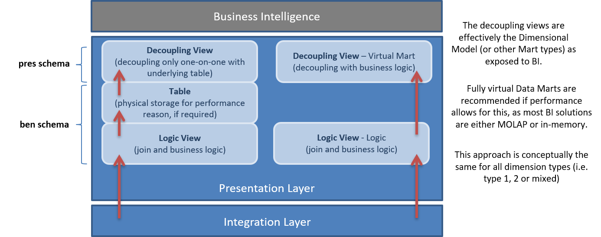
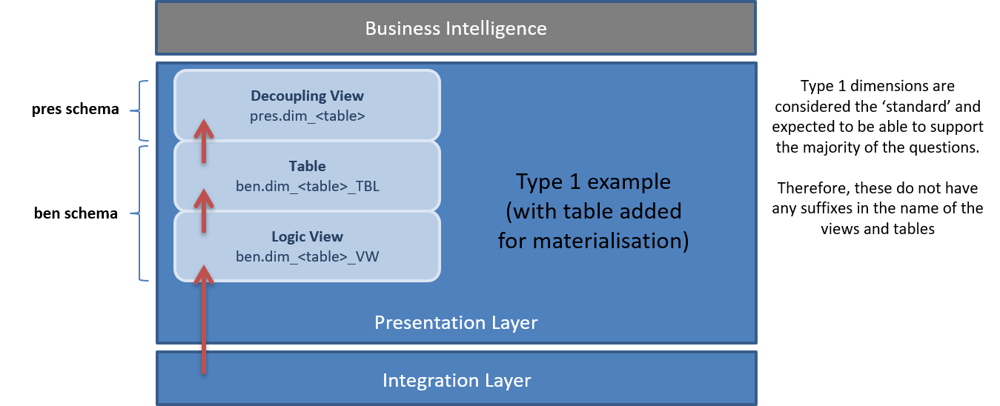
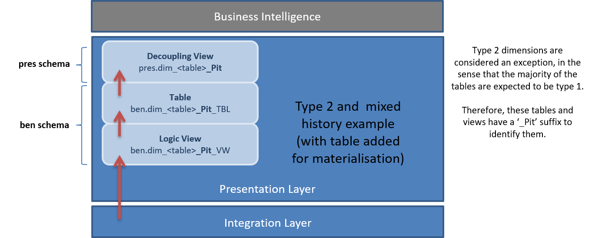

# Solution Pattern - Data Modelling - Presentation Layer

## Purpose

This Solution Pattern describes the data modelling conventions and objects used to expose and/or load dimensions in the Presentation Layer.

## Motivation

Dimensions in the Presentation Layer provide the context and descriptions against which metrics are viewed. They are the objects exposed to consumers of information in Business Intelligence environments.

Although there are many (seven to be exact) defined ways of representing history in a Dimensional Model, this pattern focuses primarily on Type 1 (current state) and Type 2 (changes over time).

Dimensions provide context for transactions (facts) captured in Fact tables. Together, Dimension and Fact tables constitute the Dimensional Model.

## Applicability

This pattern is heavily geared towards Dimensional Modelling (Dimensional or Snowflake Models), but in principle, it is also applicable to Data Vault Point-in-Time (PIT) tables and other types of time-variant tables.

## Structure

There are two main technical approaches/mechanisms to prepare information for consumption in the Presentation Layer (created in the Presentation Layer database):

- **Direct views** on top of the Integration Layer (virtual information mart). In most scenarios, this option is preferred since subsequent layers in the (BI) architecture—typically MOLAP or in-memory—address performance concerns from the end-user perspective.
- **Physical tables** (persistence) using views to join and prepare the data in the format matching the table logic, enabling incremental loading.

In both cases, these Presentation Layer objects require one or more views to decouple the Business Intelligence (BI) and Data Warehouse (DWH) environments. These decoupling views also apply the history perspective at the attribute level, e.g., how each attribute is displayed over time (Type 1, Type 2, Type 6).

### General Guidelines for Presentation Layer Development

- **Decoupling views** face the BI/business side and present information in the easiest way to consume.
- **Logic views** populate tables, geared towards ETL support, following strict naming conventions to support automation. BIML scripts can generate SSIS packages from logic views to Presentation Layer tables.
- The **`pres` schema** is the enterprise information/mart schema and contains the decoupling views. This schema effectively contains the complete dimensional model exposed to BI. Decoupling views can share the same name as the corresponding Dimension or Fact table.
- The **`ben` schema** contains logic views and tables for performance management. Since views and tables cannot share the same name in a schema, logic views are named with the `_VW` suffix.
- Normal casing with underscores (no spaces) is used for all tables and attributes.
- Definitions are maintained in the Business Glossary. Where possible, identifiers (keys/links) refer to the business logic implementation.
- Logic views are primarily manually developed (with some history merge scripts to assist) as these views handle the transition from data handling to business use.
- Tables and decoupling views can be generated from metadata.
- Decoupling views expose history using additional metadata (history type at attribute level).
- The **`extract` schema** supports data provision to external systems (e.g., non-BI) and is *not* considered part of the standard Presentation Layer.
- The **`temp` schema** is strictly used to store ETL-required information and to support ETL performance and workings.

The structure is illustrated below:

## Implementation Guidelines

Type 1 and Type 2 are developed as separate ETL workflows. This allows development of the resource-intensive Type 2 logic only when needed and enables scheduling Type 1 and Type 2 streams at different times to optimize performance.

For example, Type 1 can run daily, while the Type 2 equivalent may only run on weekends.

The naming conventions reflect these differences. Type 1 uses "normal" naming without prefixes or suffixes:

Type 2 dimensions use a suffix (`_Pit`) to differentiate objects:

### Presentation Layer **Views** Modelling Conventions

|**View Type**|**Convention**|**Columns**| **Comments**|
|-|-|-|-|
| **Logic View**| `ben.<ViewName>_VW`| `<ViewName>_SK` ETL Process Control Id Load Date/Time Deleted Record Indicator Type 1 Checksum Type 2 Checksum Effective Date/Time Expiry Date/Time Current Record Indicator | Used to load standard Dimension or Fact tables supported by BIML. The view name must match the target table name (with `_VW` suffix). Checksums and ETL process control attributes are handled by BIML for automation.|
| **Decoupling View**| `pres.<ViewName>` (regular) `pres.<ViewName>_history` (history/mixed-history) | Based on underlying `ben` table or logic view but without ETL process control attributes. Surrogate keys optional. | Business-facing views, e.g., `DIM_CUSTOMER` or `DIM_CUSTOMER_HISTORY`.                             |

### Presentation Layer **Tables** Modelling Conventions

|**Table Type**|**Convention**|**Attributes**|**Comments**|
|-|-|-|-|
| **Dimension**    | `ben.DIM_<TableName>`         | `<TableName>_SK` (primary key, 32-byte hash) ETL Process Control Id Deleted Record Indicator Type 1 Checksum Type 2 Checksum Effective Date/Time Expiry Date/Time Current Record Indicator | Unique key/index on natural keys combined with Effective Date/Time ensures unique point-in-time records. Attributes defined as Type 0, 1, 2 (or combined as Type 3 or 6), specified as extended properties. |
| **Fact Table**   | `ben.FACT_<TableName>`        | `<TableName>_SK` (primary key) Dimension Keys ETL Process Control Id Load Date/Time Deleted Record Indicator Type 1 Checksum Type 2 Checksum Effective Date/Time Expiry Date/Time Current Record Indicator | Unique key/index on Dimension keys.                                                              |
| **Other**        | `ben.<TableName>`             | `<TableName>_SK` ETL Process Control Id Load Date/Time Other ETL attributes as required                              | Not all datasets are delivered as star schemas. Wide or normalized tables preferred where applicable. |

## Considerations and Consequences

### Separation of Type 1 and Type 2 ETL Processes

This pattern separates Type 1 and Type 2 ETL streams for performance reasons. In most cases, Type 2 history is not required, so calculating a full history wastes resources.

An initial approach implementing everything as Type 2 was abandoned due to performance trade-offs.

### Usage of Surrogate Keys

While Data Vault Hub Keys (surrogate keys) can be added in the Presentation Layer for tracing and auditability, they should not be used as level keys in Dimensions. This is because levels in Dimensions may not perfectly map to a single business concept.

For example, attributes like Business Unit Type, State, Counter, and Ownership might reside in the same Satellite in Data Vault but be modelled as separate Dimensions in the Presentation Layer. Hub Keys cannot serve as level keys in this scenario. Instead, natural keys specific to each Dimension should be used for lookups and constraints to avoid creating dependencies between Integration and Presentation Layers.

### Mixed History

If the logic view and/or base table are Type 2, it is relatively straightforward to translate this into a mixed-history view. For example, half the attributes can be Type 2 and the other half Type 1, implemented in the decoupling view while leaving underlying structures as full Type 2.

## Related Patterns

- Design Pattern 002 - Generic - Types of History
