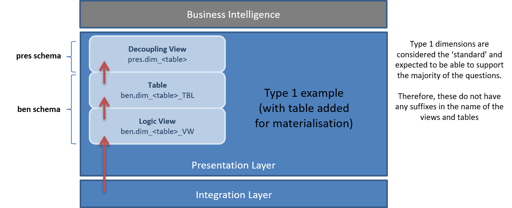

# Solution Pattern - Data Modelling - Presentation Layer

## Purpose
This Solution Pattern describes the data modelling conventions and objects used to expose and/or load dimensions in the Presentation Layer.

## Motivation

Dimension in the Presentation Layer provide the context and descriptions against which metrics are viewed. They are the objects that are exposed to consumers of information in Business Intelligence environments. There are many (seven to be exact) defined ways of how history can be represented in a Dimensional Model, but for all intents and purposes this pattern only focuses on Type 1 (current state) and Type 2 (changes over time).

Dimensions provide contexts for transactions (facts) which are captured in Fact tables. Dimension and Fact tables constitute the Dimensional Model.

## Applicability

This patterns is heavily geared towards Dimensional Modelling (Dimensional Model or Snowflake Model), but in principle is applicable to Data Vault Point-in-Time (PIT) and other types of time-variant tables as well.

## Structure

In principle, there are two technical approaches / mechanisms to prepare information for consumption in the Presentation Layer (created in the Presentation Layer database):

* A direct view on top of the Integration Layer (virtual information mart). In -by far- the most scenarios this option is preferred as the subsequent layers in the (BI) architecture are typically MOLAP or in-memory and therefore address performance concerns from an end-user's perspective.
* Table / persistence / physical storage using a view to join and prepare the data in the format that matches the table (logic) and can be used to incrementally load the table.

In both cases these Presentation Layer objects will require one or more views to decouple the Business Intelligence (BI) and Data Warehouse (DWH) environments. These decoupling views are also intended to apply the history perspective at attribute level; e.g. how every attribute is displayed in time (e.g. Type1, Type2, Type 6).

The following general guidelines have been defined for Presentation Layer development:

* The **decoupling** **views** are facing the BI / business side and aim to present information in the way it is easiest to consume.
* The **logic** **views** used to populate tables are geared towards ETL support, and follow the rigor of naming conventions to support automation. BIML scripts are available to generate SSIS packages from the logic view to the Presentation Layer tables.
* The 'pres' schema is the enterprise information / mart schema and contains the decoupling views. In other words this schema contains what is effectively the complete dimensional model exposed to the BI environment. This also allows the decoupling views to have the same name as the accompanying Dimension or Fact table.
* The 'ben' schema contains the logic views and tables required for performance management. This dedicated schema to support the 'pres' schema is required because objects (views and tables in this case) cannot be named identically. The views are named with the ‘_VW’ suffix.
* Normal casing is used, with underscores (no spaces) for all tables and attributes.
* Definitions are maintained in the Business Glossary. Where possible an identifier (key / link) is used to refer to the (implementation of) business logic.
* Logic views are primarily manually developed (with some history merge scripts to assist) as these views handle the change from data handling to business use.
* Tables and decoupling views can be generated from metadata.
* Decoupling views are used to expose history using additional metadata (history type at attribute level).
* The 'extract' schema is used for data provision to support external systems (e.g. non-BI) and is therefore considered *not* to be part of the standard Presentation Layer.
* There also is a 'temp' schema which is strictly only used to store ETL required information / to support the performance and workings of the ETL.

This is displayed in the following diagram:

## Implementation Guidelines

Type 1 and Type 2 are developed as separate ETL workflows. This allows us to only require development of (resource expensive) Type 2 logic when this is really required, and if required schedule Type 1 and Type 2 streams at different times. This helps to address performance impacts related to Type 2 calculations. 

For instance, Type 1 can run every day while for the Type 2 equivalent it may be sufficient to run in the weekend only.

The difference between the ETL processes, views and table structures is organised by adopting naming conventions. Type 1 naming is 'normal', without any prefixes or suffixes. Consider the example below:

For Type 2 dimensions a naming convention is used to differentiate the objects ('_Pit').

 The modelling conventions for the Presentation Layer **views** are outlined in the table below. 

| **View type**       | **Naming convention**                                        | **Mandatory attribute(s)**                                   | **Comment**                                                  |
| ------------------- | :----------------------------------------------------------- | :----------------------------------------------------------- | ------------------------------------------------------------ |
| **Logic View**      | ben. "View Name" _VW | "View Name" _SK ETL Process Control Id Load Date / Time ETL Process Control Id Deleted Record Indicator ETL PRocess Control Id Type 1 Checksum Type 2 Checksum Effective Date / Time Expiry Date / Time Current Record Indicator | Used to load a standard Dimension or Fact table supported by BIML. The name of the view needs to match the name of the target table (except for the _VW suffix).  The _VW suffix is required as there may be a table        with the original name in the ben schema.  The checksums for Type 1 and Type 2 calculations will be handled by the BIML, and do not need to be present in the views.  This allows for a more automated update if required. All other ETL process control attributes required in the target table are handled by the BIML scripts. |
| **Decoupling View** | pres."View Name" (for regular views) pres."View Name" _history (for history or mixed-history views) | Underlying ‘ben’ table or logic view, but without ETL process control attributes. Surrogate keys optional. | Business-facing, e.g. DIM_CUSTOMER, or DIM_CUSTOMER_HISTORY. |

The modelling conventions for the Presentation Layer **tables** are outlined in the table below. 

| Table type     | Naming convention | Mandatory attribute(s)                                       | Comments                                                     |
| -------------- | ----------------- | ------------------------------------------------------------ | :----------------------------------------------------------- |
| **Dimension**  | ben.DIM_"Table Name"    | <table_name>_SK ETL Process Control Id Deleted Record Indicator ETL Process Control Id Type 1 Checksum Type 2 Checksum Effective Date / Time Expiry Date / Time Current Record Indicator | The first attribute (SK) is the primary key, and is a hash value (32 byte character). Optionally, a unique key / index is placed on the combination of level natural keys and the Effective Date / Time. This represents a unique point in time record. See the consequences section for more details. Every attribute is specified as Type 0, Type 1, Type 2 (can be combined to type 3 or 6). This is specified in the model / database as an extended property. |
| **Fact Table** | ben.FACT_"Table Name"   | <table_name>_SK "Dimension Keys"  ETL Process Control Id Load Date / Time ETL Process Control Id Deleted Record Indicator ETL Process Control Id Type 1 Checksum Type 2 Checksum Effective Date / Time Expiry Date / Time Current Record Indicator | The first attribute (SK) is the primary key. A unique key / index is placed on the combination of Dimension keys. |
| **Other** | ben."Table Name"| "Table Name" SK ETL Process Control Id Load Date / Time Any ETL process control attributes required | Not every delivery of information is necessarily in the form of a Star Schema /   Dimensional Model. If a dataset is better delivered in a different format (wide table, normalised) this is preferred. |

## Considerations and Consequences

**Separation of Type 1 and Type 2 ETL processes**

This pattern separates the Type 1 and Type 2 streams completely for performance reasons. The idea is that in most cases there is no requirement for Type 2, so resources are wasted by having to calculate a full history if Type 1 is the only requirement. 

The initial approach used to implemented everything as Type 2 first. It seemed a good idea at the time, but it didn't work out due to performance trade-offs.

**Usage of surrogate keys**

Related to having Data Vault Surrogate (Hub) Keys (SK) in the Dimensional Model: it is possible to add Hub keys (Surrogate Keys) in the Presentation Layer for tracing and auditability purposes. However they cannot be adequately used as level keys as a level in a Dimension may not 100% map a business concept. 

For instance, a 'business unit type' may not be modelled as a Hub in the Data Vault, but could be required as a level in a Dimension. 

By using Hub Keys for Dimension lookups a dependency between the Integration and Presentation Layers is created that should be avoided. 

An example is where you have Business Unit Type, State, Counter and Ownership in the same Satellite (e.g. SAT_BUSINESS_UNIT). If these attributes are modelled in separate Dimensions in the Presentation Layer the Hub Key (from HUB_BUSINESS_UNIT) cannot be used, rather, a separate Dimension Key must be created and a dedicated natural key must be selected appropriate for the Dimension. 

In other words, lookups and constraints should be using natural keys.

**Mixed history**

If the logic view and/or base table are Type 2 it is relatively easy to translate this into a mixed-history view. If , for example, half the attributes are Type 2 and the other half are Type 1 this can be implemented in the decoupling view while leaving the underlying structures as full Type 2.

## Related Patterns
* Design Pattern 002 - Generic - Types of History
